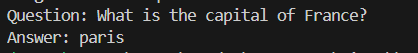

# Project: Question Answering System with RAG and Transformers

## Description
Develop a question answering system that uses a Transformer model to generate answers based on a set of documents. The system will use RAG to improve the accuracy of the answers by retrieving relevant information from the documents before generating the response.

## Project Steps

Set up a development environment with Python and the necessary libraries (Hugging Face Transformers, PyTorch, etc.).

1. Create a virtual environment
```bash
python -m venv myenv
```
Activate the virtual environment
```bash
myenv\Scripts\activate
```

2. Install Python and Necessary Libraries
pip install transformers torch faiss-cpu datasets

3. Run the script QA_system.py

4. Result of the usage example: 

